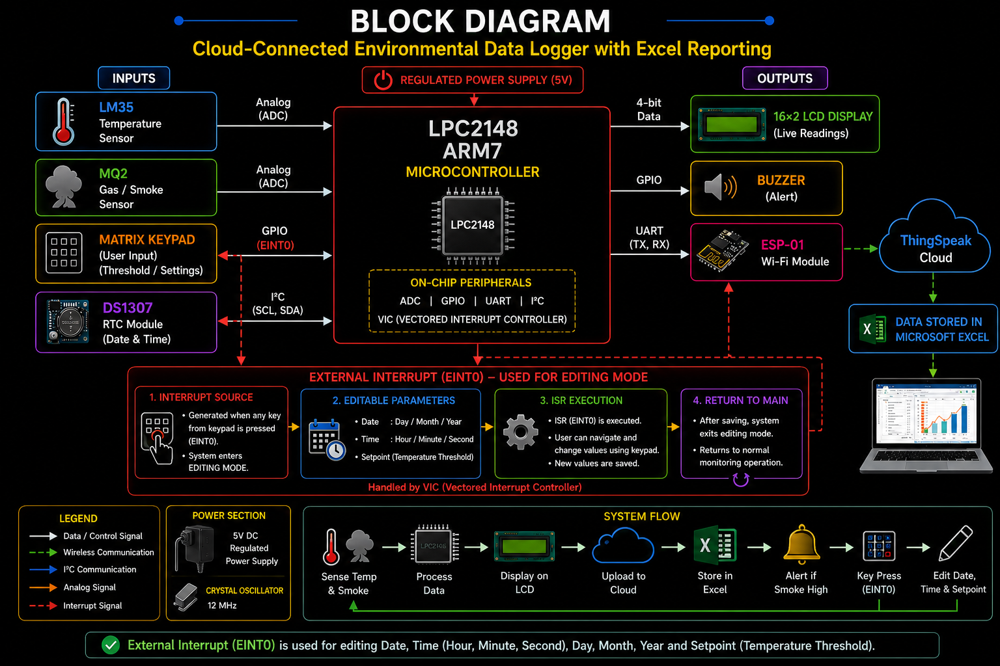

# ☁️ Cloud-Connected Environmental Data Logger with Excel Reporting

## 📌 Project Overview

Environmental conditions such as temperature and smoke concentration play a critical role in industries, warehouses, laboratories, hospitals, and smart agriculture. Manual monitoring of these parameters is time-consuming and may lead to delayed responses during abnormal conditions.

This project presents a **Cloud-Connected Environmental Data Logger with Excel Reporting**, developed using the **LPC2148 ARM7 Microcontroller**. The system continuously monitors **temperature** using the **LM35 sensor** and **smoke concentration** using the **MQ2 gas sensor**. The measured values are displayed on a **16×2 LCD**, uploaded to the **ThingSpeak Cloud** through the **ESP-01 Wi-Fi module**, and automatically recorded in **Microsoft Excel** for future analysis.

The system also utilizes **interrupts** to handle user inputs and periodic operations efficiently, ensuring faster response and better system performance. By integrating **Embedded Systems**, **IoT**, **Cloud Connectivity**, **Interrupt-driven Processing**, and **Data Logging**, this project provides a reliable real-time environmental monitoring solution.

---

## 🎯 Objectives

| Objective | Description |
|------------|-------------|
| 🌡️ Temperature Monitoring | Continuously monitor environmental temperature using the LM35 sensor |
| 🔥 Smoke Detection | Detect smoke concentration using the MQ2 gas sensor |
| ☁️ Cloud Connectivity | Upload environmental data to the ThingSpeak cloud using the ESP-01 Wi-Fi module |
| 📊 Excel Reporting | Store sensor readings with timestamps in Microsoft Excel |
| 🖥️ LCD Display | Display real-time temperature and smoke values on a 16×2 LCD |
| ⏰ Time Stamping | Record accurate date and time using the RTC module |
| 🚨 Alert System | Activate the buzzer whenever the smoke level exceeds the threshold |
| ⚡ Interrupt Handling | Use interrupts for quick response to user inputs and periodic operations |
| 🌐 Remote Monitoring | Monitor environmental conditions remotely through the cloud |

---

## 🧰 Hardware Components

| Component | Quantity | Purpose |
|-----------|:--------:|---------|
| LPC2148 ARM7 Microcontroller | 1 | Central controller of the system |
| LM35 Temperature Sensor | 1 | Measures environmental temperature |
| MQ2 Gas Sensor | 1 | Detects smoke concentration |
| ESP-01 (ESP8266) Wi-Fi Module | 1 | Uploads data to ThingSpeak cloud |
| DS1307 RTC Module | 1 | Provides date and time for logging |
| 16×2 LCD Display | 1 | Displays live sensor readings |
| Matrix Keypad | 1 | Allows user to set the temperature threshold |
| Buzzer | 1 | Generates an alert during abnormal conditions |
| Crystal Oscillator | 1 | Provides system clock for LPC2148 |
| Regulated Power Supply | 1 | Supplies stable power to the circuit |

---

## 💻 Software Requirements

| Software | Purpose |
|-----------|---------|
| Keil µVision 4 | Embedded C code development and debugging |
| Flash Magic | Upload firmware into LPC2148 |
| Embedded C | Firmware development |
| ThingSpeak | Cloud platform for IoT monitoring |
| Microsoft Excel | Stores and analyzes logged sensor data |

---

## 🏗️ System Architecture

<p align="center">
  
</p>

The **LPC2148 ARM7 Microcontroller** acts as the central processing unit of the system. It acquires environmental data from the **LM35 temperature sensor** and **MQ2 gas sensor**, processes the readings, and displays them on a **16×2 LCD**.

The **DS1307 RTC module** provides accurate date and time information for timestamping every sensor reading. The **ESP-01 Wi-Fi module** communicates with the ThingSpeak cloud through UART and uploads the environmental data for remote monitoring. The uploaded information is also stored in **Microsoft Excel** for analysis and report generation.

The system uses **interrupts** to improve responsiveness. User inputs from the keypad and other event-driven operations are handled through interrupt service routines (ISRs), allowing critical events to be processed immediately without affecting the continuous environmental monitoring process.

Whenever the smoke level exceeds the predefined threshold, the LPC2148 activates the **buzzer** to alert nearby users.

---

## 🔄 Working Principle

The Cloud-Connected Environmental Data Logger continuously monitors environmental conditions and uploads the collected data to the cloud for remote monitoring and Excel reporting. The system uses **interrupt-driven processing** to respond quickly to user actions while continuously acquiring sensor data.


```
